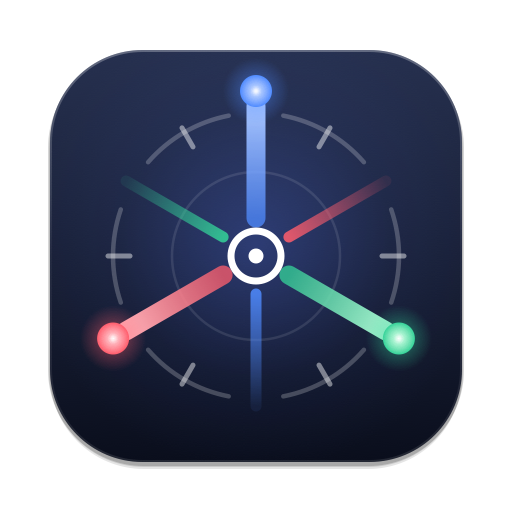
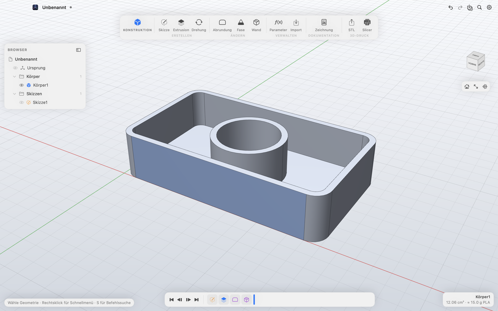
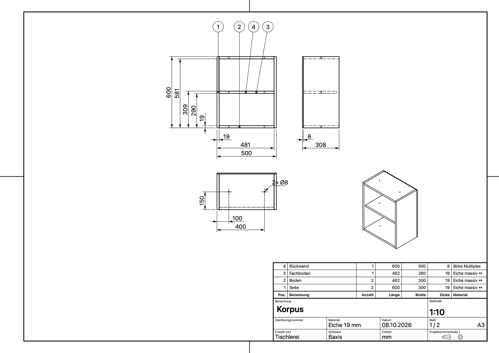

<p align="center"></p>

<h1 align="center">6axis</h1>

**Freies, natives Mac-CAD für Konstruktion und 3D-Druck – vollständig offline.**

6axis ist ein parametrisches 3D-CAD-Programm für macOS, mit einem klaren, modernen Arbeitsablauf: Skizze mit Abhängigkeiten → Extrusion/Drehung → Abrundung, Fase, Wandstärke – alles in einer Zeitleiste, die sich jederzeit nachträglich ändern lässt. Gebaut mit Swift, SwiftUI und Metal auf dem Open-Source-Geometriekernel OpenCASCADE.

*English:* 6axis is a free, open-source, fully offline parametric CAD app for macOS, with a sketch → feature → timeline workflow, focused on mechanical design, woodworking and 3D printing. The app is available in German and English (it follows the system language); contributions, including further translations, are welcome.

<p align="center">
  
  
</p>

**Produktseite:** https://melf11.github.io/6axis/ · **Download:** [neuestes Release](https://github.com/Melf11/6axis/releases/latest)

## Installation

Die fertige App gibt es unter [Releases](https://github.com/Melf11/6axis/releases/latest) (Mac mit Apple Silicon, macOS 15+). 6axis ist nicht von Apple notarisiert: Beim ersten Start einmal *Systemeinstellungen → Datenschutz & Sicherheit → Dennoch öffnen* wählen. Details auf der [Produktseite](https://melf11.github.io/6axis/).

## Updates

Ab Version 1.0.2 sucht 6axis einmal am Tag nach einer neuen Version und zeigt oben rechts einen Hinweis. Ein Klick installiert das Update und startet neu – geprüft über eine digitale Signatur. Abschaltbar unter *Einstellungen → Updates*; manuell über *6axis → Nach Updates suchen …*.

## Beispiele

Im Ordner [`Examples/`](Examples) und in der App unter **Ablage → Beispiele**: Korpus mit Fachboden und Dübellöchern (inkl. Zeichnung), Schneidebrett mit Abrundungen und Fase, Aufbewahrungsbox für den 3D-Druck. Die Maße hängen an Parametern (*Ändern → Parameter*), z. B. `breite`, `hoehe`, `tiefe`, `staerke` beim Korpus.

## Funktionen

- **Skizzen** auf Ursprungsebenen oder ebenen Körperflächen: Linie, Rechteck, Mittelpunkt-Rechteck, Kreis, 3-Punkt-Bogen – mit Rasterfang (⌘ = frei) und Maßeingabe direkt beim Zeichnen (Tab wechselt zwischen Länge, Breite, Winkel …)
- **Abhängigkeiten**: horizontal, vertikal, deckungsgleich, tangential, gleich, parallel, senkrecht, konzentrisch, Mittelpunkt, kollinear, symmetrisch, fixieren – mit automatischer H/V-Erkennung beim Zeichnen
- **Bemaßungen** (Länge, Abstand horizontal/vertikal, Punkt–Linie, Radius, Durchmesser, Winkel) mit Ausdrücken und **Benutzerparametern** (`breite / 2 + wand`)
- Anzeige der **Freiheitsgrade**; vollständig bestimmte Geometrie wird schwarz dargestellt
- Automatische **Profilerkennung** inklusive Löchern und überlappender Kurven
- **Extrusion** (eine Seite, symmetrisch, zwei Seiten; verbinden, ausschneiden, schneiden, neuer Körper) mit ziehbarem Pfeil und Live-Vorschau; ebene Körperflächen lassen sich direkt extrudieren (Press-Pull)
- **Drehung** um Achsen, Skizzenlinien oder Kanten
- **Abrundung, Fase, Wandstärke**
- **Parametrische Zeitleiste**: bearbeiten, unterdrücken, löschen, zurückrollen; Referenzen überleben Änderungen
- **Technische Zeichnung** (⇧⌘D): normgerechte 3-Tafel-Projektion (Methode 1) mit Isometrie, automatischer Bezugsbemaßung in ganzen Millimetern, Bohrungen mit Ø und Mittellinien, Radien, Fasen und Winkeln, Schriftfeld, automatischem Blatt/Maßstab, Positionsnummern, Stück-/Zuschnittliste, Einzelteilblättern, Schnitt A–A und Einzelheiten – live synchron mit dem Modell, als PDF, DXF (auch Einzelteile 1:1 für CNC/Laser) oder direkt drucken ([Plan](docs/technical-drawing.md))
- **Export**: STL (3D-Druck), STEP; **Import**: STEP; **„Im Slicer öffnen“** (PrusaSlicer, Bambu Studio, OrcaSlicer, Cura …)
- **Material und Faserrichtung** je Körper; Volumen und geschätztes Gewicht (PLA, PETG, Holz …)
- Bedienung: Ribbon, Browser, ViewCube, Radialmenü per Rechtsklick, Befehlssuche mit **S**, Tastenkürzel (L, R, C, A, D, E, F, X …)
- Automatisches Sichern: Das letzte Design (auch ungesichert) und die Ansicht werden beim nächsten Start wiederhergestellt
- **Einstellungen**: Scrollrichtung (natürliches Scrollen), Navigation, Kantenstärke, Studio-Schattierung mit Bodenschatten, Raster, STL-Qualität, Slicer
- Unbegrenztes Rückgängig/Wiederholen, Dark Mode, Retina, 120 Hz

## Bedienung

| Aktion | Trackpad | Maus |
|---|---|---|
| Drehen (Orbit) | Zwei-Finger-Wischen (in Skizzen: ⇧) | Rechte Taste ziehen / ⇧ + Mitteltaste |
| Verschieben | ⇧ + Zwei-Finger-Wischen (in Skizzen: ohne ⇧) | Mitteltaste ziehen |
| Zoomen | Pinch | Mausrad (zum Cursor) |
| Überall drehen | ⌥ + Ziehen | ⌥ + Ziehen |

| Taste | Befehl | Taste | Befehl |
|---|---|---|---|
| S | Befehlssuche | E | Extrusion |
| L | Linie | F | Abrundung |
| R | Rechteck | X | Hilfslinie umschalten |
| C | Kreis | H / V | horizontal / vertikal |
| A | Bogen | T / P | tangential / senkrecht |
| D | Bemaßung | O | Ortho/Perspektive |
| Esc | Abbrechen | ⌘↩ | Skizze fertig |

## Bauen

Voraussetzungen: macOS 14+, Xcode 16+ (Swift 6), [Homebrew](https://brew.sh).

```bash
brew install opencascade
swift test                      # Kern-Tests (Solver, Kernel, Parametrik)
scripts/build-app.sh            # erzeugt build/6axis.app
open build/6axis.app
```

Logo und App-Icon werden aus `Resources/Logo.svg` erzeugt: `python3 scripts/make-logo.py && scripts/make-icon.sh`.

Zum Entwickeln einfach `Package.swift` in Xcode öffnen und das Schema **SixAxis** starten. OpenCASCADE an anderem Ort: `OCCT_PREFIX=/pfad/zu/occt swift build`.

Automatischer UI-Durchlauf mit Screenshots (praktisch für Tests und Pull Requests):

```bash
SIXAXIS_DEMO=1 SIXAXIS_SNAPSHOTS=/tmp/6axis-shots build/6axis.app/Contents/MacOS/SixAxis
```

## Architektur

```
Sources/
  OCCTBridge/   C-Schnittstelle über OpenCASCADE (C++). Swift sieht nie C++.
  SixAxisCore/     Modell ohne UI: Dokument, Features, Skizze, Constraint-Solver,
                Ausdrucks-Parser, parametrischer Neuaufbau mit Cache, Kernel-Wrapper.
  SixAxis/      macOS-App: Editor-Zustand, Metal-Viewport, SwiftUI-Oberfläche.
Tests/          Unit-Tests für SixAxisCore.
```

- Das **Dokument** (`CADDocument`) ist ein reiner Werttyp und wird als JSON (`.6axis`) gespeichert. Undo bedeutet einfach: alte Kopie zurückholen.
- Der **ModelBuilder** spielt die Zeitleiste ab und cacht jedes Präfix per Hash. Beim Bearbeiten des letzten Features wird nur dieses neu berechnet.
- **Topologische Referenzen** (Kanten, Flächen, Profile) speichern eine geometrische Signatur und werden beim Neuaufbau zum ähnlichsten Element aufgelöst.
- Der **Skizzen-Solver** ist ein gedämpftes Least-Squares-Verfahren (Levenberg) mit Rang-Analyse für Freiheitsgrade.
- Der **Viewport** rendert mit Metal (MSAA, dicke Bildschirmraum-Linien, ID-Buffer-Picking).

## Roadmap

Der ausführliche Plan steht in [docs/roadmap.md](docs/roadmap.md). Kurz:

- **0.9** – Test-Release: App läuft ohne Homebrew, Releases per GitHub Actions, Produktseite
- **1.0** – Neuberechnung im Hintergrund, Englisch, Dateiformat-Versionierung
- **1.1–1.4** – Skizze vervollständigen, Modellieren, Prüfen & Ausgabe, Baugruppen
- **Feature-Sammlung** – Holz-Werkzeuge (System 32, Nut/Falz, Dübel, Zinken …), Plattenzuschnittplan

## Mitmachen

Beiträge sind sehr willkommen – siehe [CONTRIBUTING.md](CONTRIBUTING.md).

## Lizenz

[MIT](LICENSE). 6axis nutzt OpenCASCADE Technology (LGPL 2.1 mit Ausnahme) als dynamisch gelinkte Bibliothek.
